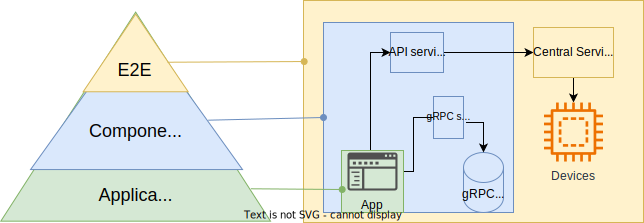

# Parameter page Integration Testing proposal

## Description of the problem:

The Parameter Page app relies on a GraphQL and gRPC service to function. However, an incorrect integration with GraphQL can lead to a malfunctioning app.

To address this issue, the development team has implemented a service integration test suite to assess how the Parameter Page makes calls to the GraphQL service. All components are containerized and deployed within our Kubernetes cluster.

Our objective is to conduct these tests BEFORE deploying any new components to the production environment.

## Integration Testing Levels:
Integration testing occurs at different levels to ensure the robustness of the application:



### Application Level:

- Recommended by Flutter to test individual pieces working together as a whole.
- Executed at development time using Test-Driven Development (TDD) techniques.
= Automated execution as part of the basic checks in the CI process.

### Components or Service Components:

- Tests the integration of the Application with other service(s) to ensure compatibility.
- For example, testing the Parameter Page Flutter app and Parameter Page API to ensure correct calls.
- Requires an advanced setup to spin up necessary components.

### End-to-End (E2E):

- Tests the full functionality of the application using all services and devices involved.
- Conducted in our test stand, as the environment is more complex and requires access to testing devices.


## Proposals:
This proposal is focused on the `Components or Service components` integration testing.

To ensure the reliability and functionality of the Parameter Page, I propose two options:

### 1) Run the test suite as part of the CI proccess

This approach provides early feedback during the development phase, allowing for quick issue identification and resolution. However, it may increase the CI time, exceeding our target of 10 minutes. The CI process will use GitHub runners on the cloud.

#### CI Workflow
1. DEV: Creates a PR to GraphQL or Parameter Pages repositories
2. CI: Runs basic checks: linters, unit testing, etc.
3. CI: Once basic checks passed, builds the app and the container.
4. CI: Runs the service integration test suite:
    1. Spin up a kind kubernetes cluster.
    2. Loads the new image into the kind cluster.
    3. Deploy parameter page, grpc, graphql and postgresql using the helm chart. Passing the new image as parameter for the desployment.
    4. Run helm test 
5. CI: Approve or block the PR based on the results.

#### PoC: 
https://github.com/mgonzal1/parameter-page-helm/actions/runs/7618209474/job/20748882167

Execution time: 2m 30s aprox 

### 2) Run the test suite as part of the CD proccess

This approach provides a final validation step, ensuring thorough testing in an environment resembling production before any changes are applied. It doesn't block the merge of new code into the repository, notifying developers later about test results. This approach will use the staging area in our Kubernetes cluster, which might benefit future E2E testing.

#### CD Workflow

1. CI: Runs basic checks, builds and push the new container image into adregistry.
2. CD: Pulls the latest image metadata from adregistry.
3. CD: Update the image in the staging environment.
4. CD: Run helm test.
5. CD: Promote the deployment to the Production area.


### Common Features in Both Proposals:

- **Contenerization of the services test suite.** The test suite is using flutter framework, which brings to challenges. 1) installing the flutter SDK and 2) the dependency of the test content with the flutter application itself. The idea is to add a step on the current parameter page CI to build a test image and use the same tag as the app. This image would be stored at adregistry.fnal.gov and can be consumed by anyone to run the testing.
The container file would look like:

```
# Dockerfile.test
# Stage 1: Build Flutter Application
FROM ubuntu:latest as builder

# Install dependencies
RUN apt-get update && \
    apt-get install -y \
    git \
    unzip \
    xz-utils \
    curl \
    libgl1-mesa-glx

# Install Flutter
RUN git clone https://github.com/flutter/flutter.git /flutter
ENV PATH="/flutter/bin:${PATH}"

RUN flutter precache  \
    && flutter channel stable \
    && flutter upgrade

# Copy the Flutter web application source code
COPY . /app
WORKDIR /app


# Build the Flutter web application
RUN flutter pub get \
    && flutter build web

# Build the Flutter web application
RUN flutter pub get \
    && flutter build web

# Copy test content
COPY test/service_tests /test/service_tests

# Run integration tests
CMD ["flutter", "test", "test/service_tests"]
```

- **Create helm chart** The creation of a helm chart to facilitate the deployment of Parameter page and its components in any environment. This chart might change in the future once the applications and its arquitecture are more mature.

- **DB Schema managed by the gRPC service**.  The postgres db will be recreated each time at the test environment to ensure a clean environment.  
